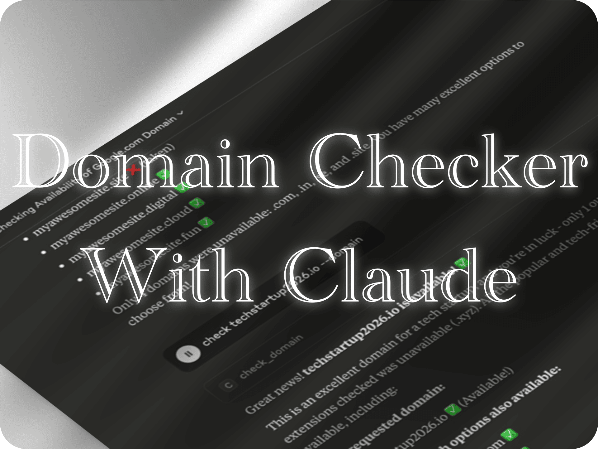

## MCP Domain Availability Checker

[](https://smithery.ai/server/imprvhub/mcp-domain-availability)

<table style="border-collapse: collapse; width: 100%; table-layout: fixed;">
<tr>
<td style="width: 40%; padding: 15px; vertical-align: middle; border: none;">A Model Context Protocol (MCP) integration that provides Claude Desktop with domain availability checking across popular TLDs.</td>
<td style="width: 60%; padding: 0; vertical-align: middle; border: none; min-width: 300px; text-align: center;"><a href="https://glama.ai/mcp/servers/@imprvhub/mcp-domain-availability">
  
</a></td>
</tr>
</table>

### Features

- **Domain Availability Checking**
  - Check availability across 50+ popular TLD extensions
  - Support for popular (.com, .io, .ai), country (.us, .uk, .de), and new TLDs (.app, .dev, .tech)
  - Authoritative verification over RDAP, the protocol that replaced WHOIS
  - WHOIS and DNS fallback for the few TLDs that publish no RDAP service
  - Smart TLD suggestions organized by popularity

- **Search Capabilities**
  - Check specific domains with exact TLD matching
  - Bulk checking across supported extensions for a given name
  - Parallel processing for faster domain queries
  - Organized results by TLD categories

- **MCP Integration**
  - Easy setup with uvx package management
  - Seamless integration with Claude Desktop
  - Real-time availability status updates
  - Performance metrics and timing information

- **AI Assistant Features**
  - Natural language domain queries through Claude
  - Automated domain suggestion workflows
  - Smart recommendations based on availability

### Demo
<p>
 <a href="https://www.youtube.com/watch?v=pJjrkEihlWE">
   
 </a>
</p>

<details>
<summary>Timestamps:</summary>
Click on any timestamp to jump to that section of the video

[**00:00**](https://www.youtube.com/watch?v=pJjrkEihlWE&t=0s) - **Checking google.com availability**  
Testing a well-known premium domain to demonstrate the domain checking functionality and alternative TLD suggestions.

[**00:20**](https://www.youtube.com/watch?v=pJjrkEihlWE&t=20s) - **Testing myawesomesite.com**  
Verifying availability for a custom domain name and exploring alternative extension options.

[**00:40**](https://www.youtube.com/watch?v=pJjrkEihlWE&t=40s) - **Verifying techstartup2026.io**  
Exploring tech startup domain options and checking availability across multiple TLD extensions.

[**01:00**](https://www.youtube.com/watch?v=pJjrkEihlWE&t=60s) - **Analyzing aitools domain**  
Checking competitive AI industry domains and analyzing market availability for startup naming.
</details>

### Requirements

- Python 3.10 or higher (3.12 recommended)
- Claude Desktop
- [uv](https://docs.astral.sh/uv/) package manager

#### Dependencies Installation

Install uv package manager using one of these methods:

**Official installer (recommended):**
```bash
curl -LsSf https://astral.sh/uv/install.sh | sh
```

**Homebrew (macOS/Linux):**
```bash
brew install uv
```

**Install Homebrew (if needed):**
- Visit [https://brew.sh](https://brew.sh) for installation instructions on all operating systems
- Or run: `/bin/bash -c "$(curl -fsSL https://raw.githubusercontent.com/Homebrew/install/HEAD/install.sh)"`

The MCP server automatically manages Python dependencies through uvx.

### Installation

#### Zero-Clone Installation (Recommended)

The MCP Domain Availability Checker supports direct installation without cloning repositories, using uvx for package management.

#### Configuration

The Claude Desktop configuration file is located at:

- **macOS**: `~/Library/Application Support/Claude/claude_desktop_config.json`
- **Windows**: `%APPDATA%\Claude\claude_desktop_config.json`
- **Linux**: `~/.config/Claude/claude_desktop_config.json`

Edit this file to add the Domain Availability MCP configuration:

```json
{
  "mcpServers": {
    "mcp-domain-availability": {
      "command": "uvx",
      "args": [
        "--python=3.12",
        "--from",
        "git+https://github.com/imprvhub/mcp-domain-availability",
        "mcp-domain-availability"
      ]
    }
  }
}
```

If you already have other MCPs configured, simply add the "mcp-domain-availability" section inside the "mcpServers" object:

```json
{
  "mcpServers": {
    "otherMcp": {
      "command": "...",
      "args": ["..."]
    },
    "mcp-domain-availability": {
      "command": "uvx",
      "args": [
        "--python=3.12",
        "--from",
        "git+https://github.com/imprvhub/mcp-domain-availability",
        "mcp-domain-availability"
      ]
    }
  }
}
```

### Installing via Smithery

To install mcp-domain-availability for Claude Desktop automatically via [Smithery](https://smithery.ai/server/imprvhub/mcp-domain-availability):

```bash
npx -y @smithery/cli@latest mcp add imprvhub/mcp-domain-availability --client claude
```

#### Manual Installation

For development or local testing:

1. Clone the repository:
```bash
git clone https://github.com/imprvhub/mcp-domain-availability
cd mcp-domain-availability
```

2. Install dependencies:
```bash
uv sync
```

3. Run locally:
```bash
uv run src/mcp_domain_availability/main.py
```

### Deploying with Docker to Google Cloud Run

The MCP server supports two transport modes:
- **stdio** (default): For Claude Desktop integration via stdin/stdout
- **sse**: For HTTP/web deployments like Google Cloud Run

When deploying to Cloud Run, the `MCP_TRANSPORT` environment variable must be set to `sse`.

**Prerequisites:**
- [Google Cloud SDK](https://cloud.google.com/sdk/docs/install) installed and authenticated (`gcloud auth login`)
- [Docker](https://docs.docker.com/get-docker/) installed and running
- A Google Cloud Project with the Cloud Run and Container Registry APIs enabled

#### Using the Deployment Script

The easiest way to deploy is to use the `deploy.sh` script.

1.  **Edit the script:**
    Open `deploy.sh` and replace `...` with your Google Cloud `PROJECT_ID`. You can also change the `REGION` if needed.

2.  **Run the script:**
    Make the script executable and run it.
```sh
    chmod +x deploy.sh
    ./deploy.sh
```
    The script will build the Docker image, push it to Google Container Registry, and deploy it to Cloud Run with `MCP_TRANSPORT=sse`.

#### Manual Deployment

Alternatively, you can run the commands manually.

1.  **Set environment variables:**
```sh
    export PROJECT_ID="<YOUR_PROJECT_ID>"
    export REGION="<YOUR_REGION>"
    export IMAGE="gcr.io/$PROJECT_ID/mcp-domain-availability:latest"
```

2.  **Build and push the Docker image:**
```sh
    docker buildx build --platform linux/amd64 -t $IMAGE --push .
```

3.  **Deploy to Google Cloud Run:**
```sh
    gcloud run deploy mcp-domain-availability \
      --image $IMAGE \
      --region $REGION \
      --platform managed \
      --allow-unauthenticated \
      --port 8080 \
      --set-env-vars MCP_TRANSPORT=sse \
      --project $PROJECT_ID
```

**Note:** For local Claude Desktop usage, no environment variables are needed. The server defaults to `stdio` transport mode.

### How It Works

ICANN retired WHOIS as the required registration-data protocol in January 2025 in favour of
**RDAP** (RFC 7482/9082), so RDAP is the primary source here. It is unambiguous: a registry's
RDAP service answers `404` for an unregistered domain and `200` for a registered one.

1. **RDAP** — the registry's own RDAP service, discovered through
   [IANA's bootstrap registry](https://data.iana.org/rdap/dns.json) (about 1,200 TLDs).
   This is authoritative.
2. **WHOIS** — only for TLDs with no RDAP service (`.io`, `.co`, `.me`, `.de`, `.es` and some
   other ccTLDs). The registry's WHOIS server is found via IANA referral and queried directly
   over port 43; only the first lines of the response are interpreted.
3. **DNS** — a name that resolves is definitely registered.

Each domain comes back as one of three statuses:

| Status | Meaning |
|--------|---------|
| `available` | The registry confirmed there is no registration |
| `taken` | The registry confirmed a registration, or the name resolves in DNS |
| `undetermined` | No authoritative source answered. **Not** the same as available |

`undetermined` exists because the previous version reported a domain as *available* whenever a
WHOIS lookup raised an error — including when the machine had no `whois` binary installed, in
which case every domain looked free. A result you cannot trust is now labelled as such.

Domains are checked concurrently, capped at 10 in flight to stay within registry rate limits.

### Available Tools

> **Changed in 0.2.0**: the `--domain` flag is no longer required — ask for a domain in plain
> language. The flag is still accepted so existing prompts keep working. Bulk TLD checking moved
> into its own tool, so asking about one domain no longer triggers ~95 lookups.

| Tool Name | Description | Parameters |
|-----------|-------------|------------|
| `check_domain` | Check one specific domain | `domain`: e.g. `mysite.com`. A bare name with no TLD is checked across the popular TLDs |
| `suggest_domains` | Check one name across many TLDs | `name`: e.g. `mysite`; `category`: `popular` (default, 12), `country` (36), `new` (49) or `all` (~95) |

### Supported TLD Categories

#### Popular TLDs (12)
com, net, org, io, ai, app, dev, co, xyz, me, info, biz

#### Country TLDs (36)
us, uk, ca, au, de, fr, it, es, nl, jp, kr, cn, in, br, mx, ar, cl, pe, ru, pl, cz, ch, at, se, no, dk, fi, be, pt, gr, tr, za, eg, ma, ng, ke

#### New TLDs
tech, online, site, website, store, shop, cloud, digital, blog, news & more.

### Example Usage

Here are examples of how to use the MCP Domain Availability Checker with Claude:

#### Single Domain Check

```
Is mysite.com available?
```

#### Domain Name Research

```
Check "startup" across all TLDs
```

#### Specific Domain Verification

```
Is awesome.io taken?
```

### Output Format

The tool provides comprehensive results including:

- **Requested Domain**: Status of the exact domain queried (if a specific TLD was provided)
- **Available Domains**: Confirmed unregistered, sorted alphabetically
- **Unavailable Domains**: Confirmed registered
- **Undetermined Domains**: No authoritative answer, with the reason
- **Summary Statistics**: Breakdown by TLD categories (Popular, Country, New TLDs)
- **Performance Metrics**: Check duration and which source answered (`rdap`, `whois` or `dns`)

### Development

Run the offline test suite (no network required):

```bash
uv sync
uv run python -m unittest discover -s tests -v
```

Check a domain from the command line:

```bash
uv run mcp-domain-availability-cli example.com
uv run mcp-domain-availability-cli mysite popular
```

### Troubleshooting

#### "Server disconnected" error
If you see connection errors in Claude Desktop:

1. **Verify uvx installation**:
   - Run `uvx --version` to ensure uvx is properly installed
   - Reinstall uv if necessary: `curl -LsSf https://astral.sh/uv/install.sh | sh`

2. **Check Python version**:
   - Ensure Python 3.10+ is available: `python3 --version`

#### "ModuleNotFoundError: No module named 'mcp.server.fastmcp'"
Version 2.0 of the MCP Python SDK removed `mcp.server.fastmcp`. Releases of this server before
0.5.0 imported it without capping the SDK version, so any fresh install picked up SDK 2.x and
failed at startup. 0.5.0 is written for SDK 2.x. If you still see the error, uv is running a
cached copy of the old code:

1. **Refresh the cached install**:
   - Run `uvx --refresh --from git+https://github.com/imprvhub/mcp-domain-availability mcp-domain-availability`
   - If you installed it as a persistent tool, run `uv tool upgrade mcp-domain-availability`

2. **Remove the old workaround**: if you added `"--with", "mcp<2.0.0"` to your client config,
   delete it. 0.5.0 requires SDK 2.x and will not start with that pin.

### DNS resolution issues
If domain checks are failing:

1. **Network connectivity**:
   - Verify internet connection is stable
   - Check if DNS servers are accessible

2. **Rate limiting**:
   - Large bulk checks may hit rate limits from DNS/WHOIS services
   - The tool uses a semaphore to limit concurrent requests to 20

#### Configuration issues
If the MCP server isn't starting:

1. **Verify configuration syntax**:
   - Ensure JSON syntax is valid in `claude_desktop_config.json`
   - Check that all brackets and quotes are properly matched

2. **Restart Claude Desktop**:
   - Close and restart Claude Desktop after configuration changes

## Development

#### Project Structure

- `main.py`: Main entry point with MCP server and domain checking logic
- Domain checking functions with DNS, WHOIS, and socket fallback methods
- TLD management with categorized lists
- Async processing for parallel domain checks

#### Building

```bash
uv build
```

### Testing

```bash
uv run pytest
```

#### Local Development

```bash
uv run main.py
```

### Security Considerations

The MCP Domain Availability Checker makes external network requests to DNS servers and WHOIS services. Users should be aware that:

- Domain queries may be logged by DNS providers
- WHOIS queries are typically logged and may be rate-limited
- No personal information is transmitted beyond the domain names being checked
- All queries are read-only and do not modify any external systems

### Contributing

Contributions are welcome! Areas for improvement include:

- Adding support for additional TLD categories
- Implementing caching mechanisms for faster repeated queries
- Enhancing WHOIS parsing for more detailed domain information
- Improving error handling and retry mechanisms

### License

This project is licensed under the Mozilla Public License 2.0 - see the [LICENSE](https://github.com/imprvhub/mcp-domain-availability/blob/main/LICENSE) file for details.


## Related Links

- [Model Context Protocol](https://modelcontextprotocol.io/)
- [Claude Desktop](https://claude.ai/download)
- [uv Package Manager](https://docs.astral.sh/uv/)
- [MCP Series](https://github.com/mcp-series)
